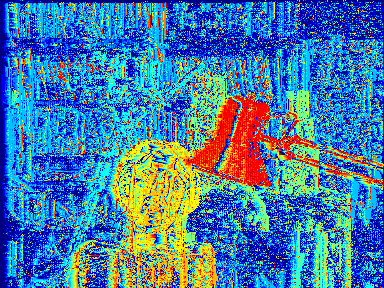

# Image_Depth_Information_Reconstruction

The objective of this project is to calculate the depth of ojects in image using left and right image from camera by 3 methods:
- Pixel-wise matching
- Window-based matching
- Window-based matching with cosin similarity
 

1. Pixel-wise_matching  

Input images left and right:  
  
Output image:  
  

2. Window-based matching  
Input images:  
  
Output image:  
  
4. Window-based matching with cosin similarity  
Input images:  
  
Ouput image:  
  
